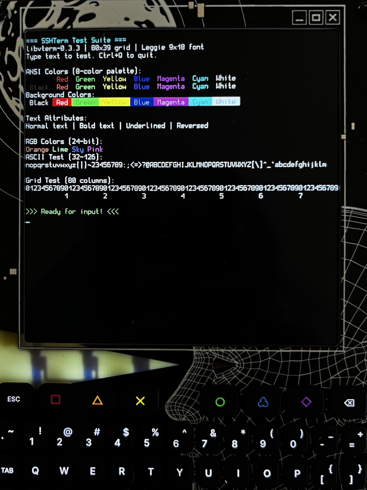

# SSH Terminal for WHY 2025 Badge

A minimal SSH terminal emulator designed for the MCH2025 badge.

## AI Usage / Disclaimer:

This project is developed with a lot of AI agent assistance - in fact, almost no code
has been written by the author himself. The project is meant as an experiment on agentic
coding and is used to explore what can be done without having specific C language skills
but a (hopefully) solid understanding regarding good software engineering practises. In
fact, I would not say that I'm an expert sofware developer in any language.
So - if code quality sucks, don't blame me! ;-)

I do not advise to use this for productive purposes. There has not been any human review
by anyone who really knows coding in C. Although, if YOU have this knowledge, I would be
really grateful for a review and your feedback!

~cyb3rk4t

## What it does

- **Terminal emulation**: VT100/xterm-compatible terminal with 80×39 character grid
- **SSH connectivity**: Connect to remote hosts via SSH with password authentication (TODO)
- **Hardware optimized**: Runs on 720×720 display with custom badge keyboard input
- **Real-time rendering**: Efficient terminal display with color support and cursor blinking



## Features

- Full UTF-8 text support with 24-bit RGB colors
- Comprehensive keyboard mapping (arrows, modifiers, control keys)
- libvterm-based terminal emulation for excellent compatibility
- SDL3-powered rendering optimized for the badge display
- Leggie 9×18 bitmap font for crisp text rendering

## Quick Start

### Prerequisites

- CMake 3.16 or later
- SDL3 development libraries
- GCC or Clang compiler

Install SDL3 using Homebrew (macOS):
```bash
brew install sdl3
```

### Building for Local Development

#### Quick Build
Use the provided build script:
```bash
# Build the project
./build.sh

# Build and run immediately
./build.sh run
```

#### Manual CMake Build
```bash
mkdir build
cd build
cmake ..
make

# Run the terminal
./bin/sshterm
```

### Build Options

Enable fullscreen mode:
```bash
cmake -DBADGEVMS_FULLSCREEN=ON ..
make
```

### Building for Badge Hardware

Use the ESP-IDF build system as part of the main firmware. The CMake configuration in this directory is only for local development and testing.

## Documentation

- **[ARCHITECTURE.md](ARCHITECTURE.md)** - Detailed technical design and implementation
- **[LICENSE](LICENSE)** - GPLv3 licensing information
- **[THIRD_PARTY_NOTICES.md](THIRD_PARTY_NOTICES.md)** - Third-party component attributions

## Dependencies

- SDL3 (rendering and input) - provided by BadgeVMS
- libvterm 0.3.3 (terminal emulation) - vendored
- Leggie font by Wiktor Kerr (display) - vendored
- libssh2 + mbedTLS (SSH connectivity, planned) - vendored

## License

GPLv3 - see [LICENSE](LICENSE) for details.
